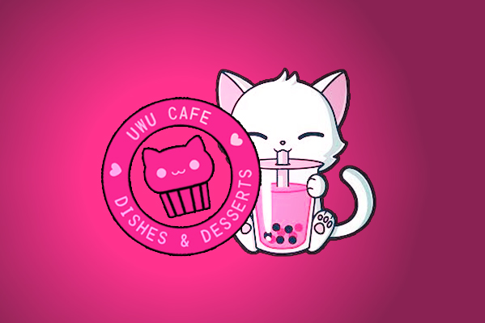

<html>
<head>
  <title>Menu Calculator</title>
    
  
</head>
<body>
	

 
<body style="background-color:deeppink;">
	
  <h1>Menu Calculator</h1>
  
  <h2>Menu Items</h2>

  

  
  <h3>Specials</h3>

  

  
  

    <input type="checkbox" id="uwueats" value="1200$">
    <label for="Velmachoice">UWU Eats - 1200$</label>
    <input type="number" value="1" min="1">
  

  
  

    <input type="checkbox" id="Davechoice" value="1500$">
    <label for="Davechoice">Uwu Daddy Specials - 1500$</label>
    <input type="number" value="1" min="1">
  

  
  

    <input type="checkbox" id="Davechoice" value="1500$">
    <label for="Davechoice">UWU Mommy Special - 1500$</label>
    <input type="number" value="1" min="1">
  

  
  

    <input type="checkbox" id="Davechoice" value="250">
    <label for="Davechoice">Hot Gworl Special - 250$</label>
    <input type="number" value="1" min="1">
  

  <!--This is where you change the combos with prices-->
  
  
  <h3> Combos </h3>
  
  

    <input type="checkbox" id="ColinChoice" value="300"><!--The price is the value, change that and then the name and itll change on the menu-->
    <label for="ColinChoice">Colin's Choice - 300$</label>
    <input type="number" value="1" min="1">
  

  
  

    <input type="checkbox" id="JudysChoice" value="300">
    <label for="JudysChoice">Judy's Choice - 300    $</label>
    <input type="number" value="1" min="1">
  

  
  

    <input type="checkbox" id="Velmachoice" value="300$">
    <label for="Velmachoice">Velma's choice - 300$</label>
    <input type="number" value="1" min="1">
  

  
  

    <input type="checkbox" id="Davechoice" value="300$">
    <label for="Davechoice">Daves's Choice - 300$</label>
    <input type="number" value="1" min="1">
  

  
  

 
 
 <h3> Cat Tuccino Specials </h3>
 

    <input type="checkbox" id="cat10" value="1600">
    <label for="cat10">10 for 1600$</label>
    <input type="number" value="1" min="1">
  

  
  

    <input type="checkbox" id="cat20" value="2500">
    <label for="cat20">20 for 2500$</label>
    <input type="number" value="1" min="1">
  

  
  

    <input type="checkbox" id="cat30" value="3500">
    <label for="cat30">30 for 3500$</label>
    <input type="number" value="1" min="1">
  

  

    <input type="checkbox" id="cat30" value="4500">
    <label for="cat40">40 for 4500$</label>
    <input type="number" value="1" min="1">
  

  
   

    <input type="checkbox" id="cat50" value="5500">
    <label for="cat50">50 for 5500$</label>
    <input type="number" value="1" min="1">
  

  
  

    <input type="checkbox" id="cat100" value="9000">
    <label for="cat50">100 for 9000$</label>
    <input type="number" value="1" min="1">
  

  
  

  

  
   <h3> Entree </h3>
  
  

    <input type="checkbox" id="Salad" value="150">
    <label for="Salad">Salad - 150$</label>
    <input type="number" value="1" min="1">
  

  
  

    <input type="checkbox" id="FruitExplosion" value="200">
    <label for="FruitExplosion">Fruit Explosion - 200$</label>
    <input type="number" value="1" min="1">
  

  
  

    <input type="checkbox" id="TurkeySammie" value="150">
    <label for="TurkeySammie">Turkey Sammie - 150$</label>
    <input type="number" value="1" min="1">
  

  
   

    <input type="checkbox" id="BeefSammie" value="150$">
    <label for="BeefSammie">Beef Sammie - 150$</label>
    <input type="number" value="1" min="1">
  

  
  

    <input type="checkbox" id="BLTSammie" value="150">
    <label for="BLTSammie">Blt Sammie - 150$</label>
    <input type="number" value="1" min="1">
  

  
  

    <input type="checkbox" id="choccypanckaes" value="175">
    <label for="choccypanckaes">Choccy Panckaes - 175$</label>
    <input type="number" value="1" min="1">
  

  
  

  
  
  <h3> Beverage </h3>
  
  

    <input type="checkbox" id="FrozenYoghurt" value="125">
    <label for="FrozenYoghurt">Frozen Yoghurt - 125$</label>
    <input type="number" value="1" min="1">
  

  
  

    <input type="checkbox" id="FreshLemonade" value="200">
    <label for="FreshLemonade">Fresh Lemonade - 200$</label>
    <input type="number" value="1" min="1">
  

  
  

    <input type="checkbox" id="IcedCoffee" value="125">
    <label for="IcedCoffee">Iced Coffee - 125$</label>
    <input type="number" value="1" min="1">
  

  
   

    <input type="checkbox" id="MatchaLatte" value="125">
    <label for="MatchaLatte">Matcha Latte - 125$</label>
    <input type="number" value="1" min="1">
  

  
  

    <input type="checkbox" id="PumpkinSpiceLate " value="125">
    <label for="PumpkinSpiceLate">Pumpkin Spice Late  - 125$</label>
    <input type="number" value="1" min="1">
  

  
  

    <input type="checkbox" id="CatTuccino" value="200">
    <label for="CatTuccino">Cat Tuccino - 200$</label>
    <input type="number" value="1" min="1">
  

  

    <input type="checkbox" id="BobbaTea " value="125">
    <label for="BobbaTea">Bobba Tea  - 125$</label>
    <input type="number" value="1" min="1">
  

  
  

    <input type="checkbox" id="GreenTea" value="125">
    <label for="GreenTea">Green Tea - 125$</label>
    <input type="number" value="1" min="1">
  

  
  
  

  
    <h3> Dessert </h3>
  
  

    <input type="checkbox" id="HomemadeCatCookie" value="125">
    <label for="HomemadeCatCookie">Homemade Cat Cookie - 125$</label>
    <input type="number" value="1" min="1">
  

  
  

    <input type="checkbox" id="AppleCrumble" value="125">
    <label for="AppleCrumble">Apple Crumble - 125$</label>
    <input type="number" value="1" min="1">
  

  
  

    <input type="checkbox" id="CatDonut" value="125">
    <label for="CatDonut">Cat Donut - 125$</label>
    <input type="number" value="1" min="1">
  

  

    <input type="checkbox" id="CatCupcake" value="125">
    <label for="CatCupcake">Cat Cupcake - 125$</label>
    <input type="number" value="1" min="1">
  

  
  

  
  <h3> Delivery </h3>
  
  

    <input type="checkbox" id="CityDelivery" value="250">
    <label for="CityDelivery">City Delivery - 250$</label>
    <input type="number" value="1" min="1">
  

  
  

    <input type="checkbox" id="Sandy" value="500">
    <label for="Sandy">Sandy Delivery - 500$</label>
    <input type="number" value="1" min="1">
  

  
  

    <input type="checkbox" id="Paleto" value="750">
    <label for="Paleto">Paleto Delivery - 750$</label>
    <input type="number" value="1" min="1">
  

  
  

  

  
  <h3> Discount Items</h3> 
  

  <input type="checkbox" id="25off" value="-25%">
  <label for="25off">Mech, EMS, LEO Disount - 25% off </label>
  <input type="number" value="1" min="1" max="1">

  <input type="checkbox" id="30off" value="-30%">
  <label for="30off">Non Fresh Items - 30% off</label>
  <input type="number" value="1" min="1" max="1">

  <input type="checkbox" id="50off" value="-50%">
  <label for="50off">Employee Discount - 50% off</label>
  <input type="number" value="1" min="1" max="1">

<h3>Misc.</h3>

  <input type="checkbox" id="MysteryGift" value="5000" >
  <label for="MysteryBox">Mystery Gift - $5000</label>
  <input type="number" value="1" min="1">

  <input type="checkbox" id="MysteryGift" value="2500" >
  <label for="MysteryBox">Mystery Gift(50% off) - $2500</label>
  <input type="number" value="1" min="1">

    <label for="name">Employee's Name:</label>
    <input type="text" id="name">
  

  
<b> Include Kitchen and Front staff in names section </b>

 

  Total: $
  0.00

  Commision (8%): $
  0.00

 
  
  
  

  

  <button class="calculate-button" onclick="calculateTotal()">Calculate Total</button>
  <button class="submit-button" onclick="submitAndReset()">Submit Order</button>
  <button class="reset-button" onclick="resetCalculator()">Reset</button>

 
  
  
  

